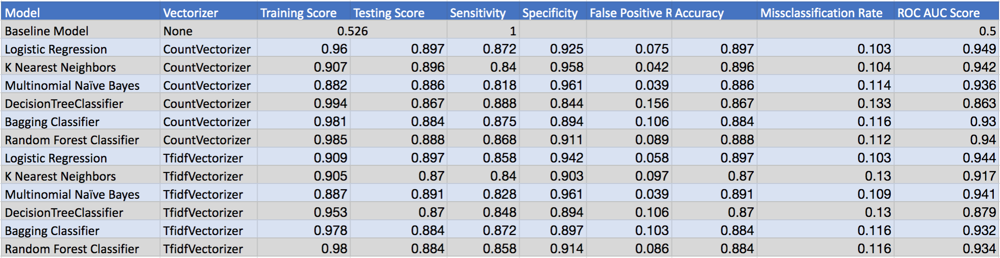
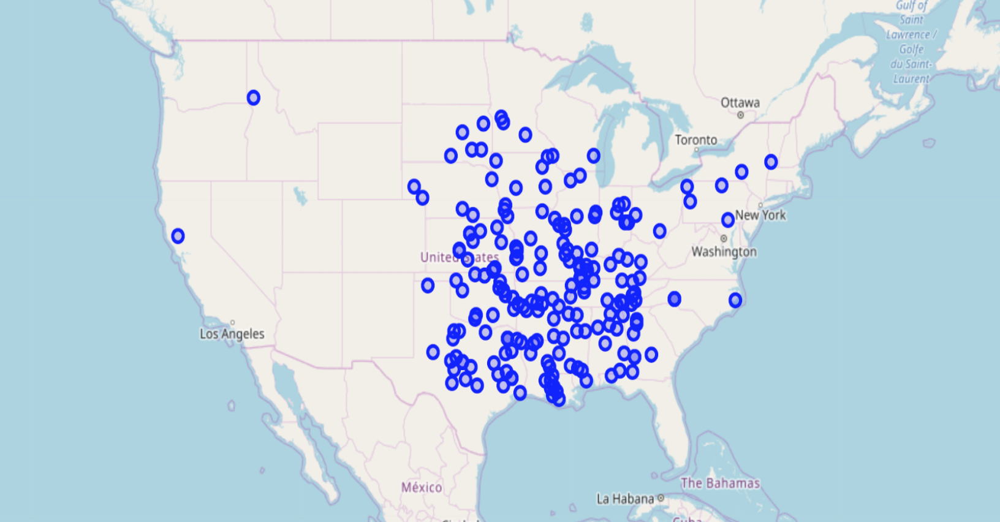
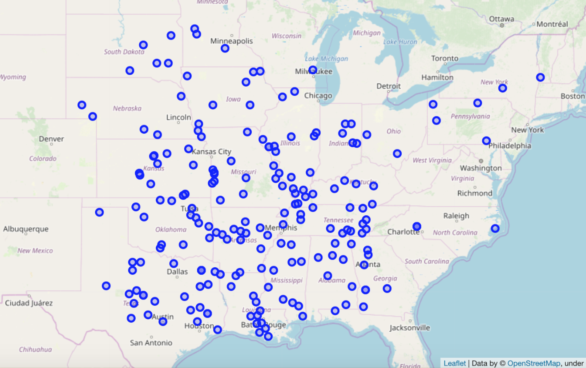

# Using Social Media to Map Floods in the United States

General Assembly | Data Science Immersive  
Authors: *Andrea Yoss, Grace Powell, Dimitri Kisten*

---
---

## Table of Contents

- [Problem Statement](#introduction) 
- [Executive Summary](#methodology)
- [Data](#Data)
- [Modelling](#model)
- [Mapping](#mapping)
- [Conclusions](#conclusion)
- [Recommendations, & Further Application](#further)
- [Sources](#sources)

## Project Files

- [Get Old Tweets](https://github.com/Graceallison/Detecting-and-Mapping-Natural-Disasters/blob/master/Code/GetOldTweets3%20.ipynb) 
- [Cleaning](https://github.com/Graceallison/Detecting-and-Mapping-Natural-Disasters/blob/master/Code/Cleaning.ipynb)
- [EDA & FEMA](https://github.com/Graceallison/Detecting-and-Mapping-Natural-Disasters/blob/master/Code/EDA%20%20%26%20FEMA.ipynb)
- [Modelling](https://github.com/Graceallison/Detecting-and-Mapping-Natural-Disasters/blob/master/Code/Modeling.ipynb)
- [Mapping](https://github.com/Graceallison/Detecting-and-Mapping-Natural-Disasters/blob/master/Code/Mapping%20(1).ipynb)

# Problem Statement  

According to the National Oceanic and Atmospheric Administration (NOAA) the amount of billion dollar (adjusted for inflation) natural disasters per year since since 1980 has been on a steady uptrend with 3 of such events in 1980 and 14 in 2019. Although this number has increased dramatically for the United States as well as the rest of the world, the total number of deaths has fallen dramatically. Part of the reason for this is that people are able to recieve alerts and warnings much faster which allows them more time to prepare and evacuate. Many weather organizations have in place systems to alert the public about natural disasters and which areas are affected. *But what if there are locations that are out of the system's reach? Can these weather systems always give precise mapping of a storm? What if power goes out in a widespread area causing a system to be delayed or innacurate?* **In the face of some of these challenges, social media, specifically Twitter, can be leveraged to accurately detect and map various types of natural disasters**. Twitter allows us to search for tweets pertaining to the event we are looking to map as well as provide geolocation of where that tweet was sent from, and a timestamp of when the tweet was sent. Using these features we can build a model to validate and then map tweets pertaining to an event. This will ultimately allow for a more up to date service first responders can use to reach isolated civilians in the even of a crisis.

Our model will aim to classify whether or not a flood related tweet is actually referring to a flood or not.  This is vital to mapping floods via social media because we want to produce an accurate map without false signals. False positives or signalling a flood when there is none (specificity) and false negatives or signalling no flood when there is one (sensitivity) will also be taken into consideration and optimized when choosing our final model as these two things have different real life ramifications. For these reasons we will optimize our model for **accuracy** and either **sensitivity** or **specificity**.

# Executive Summary 

For this project we decided to focus on floods within the United States. To obtain flood data we scraped Tweets using the GetOldTweets3 API. These APIs allowed us to scrape tweets with certain keywords pertaining to floods, from a certain location, within a certain timeframe. In order to create a model that validated whether or not a tweet was really about a flood we needed to create data to train on. We used the OPENFema Dataset of Disaster Declaration Summaries to determine which flood tweets from which locations and time ranges would be assigned a target variable of '1' for 'flood' and which tweets would be assigned '0' for no flood or false positive. Using the '.setMaxTweets' parameter we made sure each scrape had an equal amount of data to ensure balanced classes. Our data consisted of 2702 tweets split between tweets pertaining to floods during a flood event and during a period of no floods.  

Each tweet contained the text, geolocation, username, and timestamp. The initial step in cleaning was to drop duplicate tweets and to then clean the actual text.  We removed unecessary characters (https, symbols, etc) and words that did not provide useful information or were not part of the english dictionary. There was also some manual inspection to make sure that tweets actually supported our classification assumption of 'flood' vs 'no flood.' Each dataframe for each state and time period was then combined into one.

To find the best model we applied gridsearch and pipelines to our data. We used Count Vectorizer along with Tifdf Vectorizer on Logistic Regression, Multinomial Naive Bayes, Decision Tree Classifier, Bagged Trees Classifier, and Random Classifier models. For each step of modelling we increased the size of the dataset with additional scraping until we arrived at roughly 2700 rows of data where we obtained our best score on our Count Vectorizer Logistic Regression model. 

# Data 

Tweets were gathered using GetOldTweets:

|File name| Description|
|---|---|
|[FEMA Disaster Dataset](./datasets/DisasterDeclarationSummaries.csv)| Summary of all federally declared disasters from 1953. Contains 3 disaster declaration types (major disaster, emergency, and fire management)|
|[FEMA Disaster Dataset - Floods](./datasets/df_fema.csv)| A cleaned dataset of the aforementioned FEMA Disaster Dataset to only include floods. |
|[Scraped Tweets](./datasets/df_IA_TX_WI_clean_adjusted.csv)| Tweets from Iowa, Texas, and Wisconsin into one combined dataset with assigned targets 0 and 1 to indicate if a flood was present at the time of tweet.|

# Modelling 

Accuracy was the most important metric to optimize for in this scenario for the purpose of creating an accurate map. We want to make sure that tweets referring to floods are actually indicative of a flood and are not talking about other topics. When validating tweets we also considered optimizing for specificity (false positives) and sensitivity (false negatives). Ultimately we decided to optimize for sensitivity because the real life effect of overlooking false negatives has much more detrimental effects than falsely signalling a flood when there isn't. Our model would overlook areas actually affected by a flood which might prevent first responders from reaching the affected area or prevent citizens from making adequate preparations for a flood, both of which could lead to increased damage, injuries, or death. This is much more of a concern vs the effect of too many false positives. 

#### Model Scores

# Mapping 

Our mapping of floods was in part based on actual data from our FEMA and in part generated coordinates using that data. Since our API could not provide geolocation of a tweet we made a pre-production model that would represent what our map might look like given the access to that data. These points represent areas that were confirmed sites of a flood via the FEMA dataset and then a distribution of generated data points surrounding the FEMA point. Had we been given access to geolocation, our model would aim to first validate a tweet on whether or not it indicated a flood, and then take that geolocation data to be plotted on our live map. The more data available the better and more granular our map. 

# Findings & Conclusions 
Our primary findings from the model are that it is easier to validate tweets pertaining to floods on a state by state basis rather than on a national level. This is most likely because discussions on Twitter can be state specific so NLP in one state is not the best to apply in another state. If we were to make a production model we would most likely have to make state specific models as incorporating all states into one model caused a significant decrease in our scores. Another thing to consider from our models is that the decision to optimize for specificity or sensitivity given the context of our problem is not always black and white. False negatives and false positives both have adverse effects and highly favoring one over the other has detrimental effects. For example, the goal of this model would be to inform the population of the scope of a natural disaster as well as direct aid to locations affected by natural disasters. If we have too many false negatives then the number of people who will not receive aid increases and many others will not know the full scope of an affected area which could further cause injury / damage. On the flip side if we have too many false positives, we could incur costs on a population as they spend extra time and resources preparing for something that is not imminent. More importantly this might increase the adverse effects of false negatives because now you have first responders and resources being directed to an area that is not actually affected which takes away aid from actual affected areas (true positives). The tradeoffs from both of these things had to be considered when selecting the 'best' model.

# Further Applications & Limitations 
From our map it's evident that most of the floods in the United States in 2019 are from the midwest and south with very few elsewhere which means that the robustness of our model will vary from state to state. We won't have as much data to train and test on in states were floods are rare. Additionally we found that not as many people tweeted about floods; most of our Tweets were from weather accounts and government agencies so the actual 'social mapping' concept is limited as there are very few people live tweeting a flood, or it didn't provide much more information than the tweets generated by weather/gov't accounts. It is a possibility as the popularity of Twitter increases that the intended functionality of the model increases. Addtionally, privacy is increasingly a concern for all social media users and most people opt to not include their city/county or state location in their tweet which also limits the functionality of our model.

To extend the usability of our model and to overcome to limitations on location data a possible idea is to scrape the following or followers list of a user and scan those users tweets/bios to pinpoint a probable location of that user by getting data from his/her friends. For example if a user has a large majority of their followers/following who have city X in their bio or as their tweet location, we can predict that this person is likely from city X. We could also scrape the user's past tweets to see if at any point they had their location on when tweeting, or scrape the content of their tweets and liked tweets to see which location is mentioned the most. This would require an additional model that would tell us whether or not we can accurately predict a user's location based on that data. 

# Sources

* NOAA: https://www.ncdc.noaa.gov/billions/time-series
* Economist: https://www.economist.com/graphic-detail/2017/08/29/weather-related-disasters-are-increasing
* APIs Used: 
    * GetOldTweets: https://pypi.org/project/GetOldTweets3/
